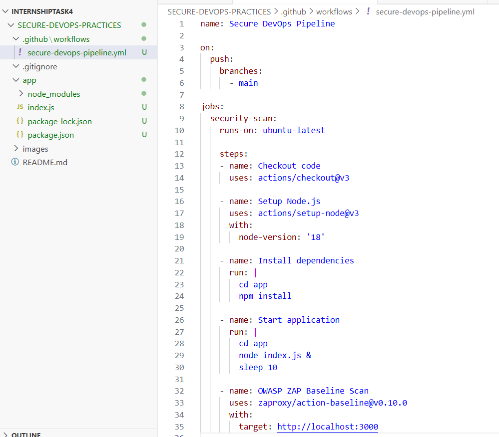
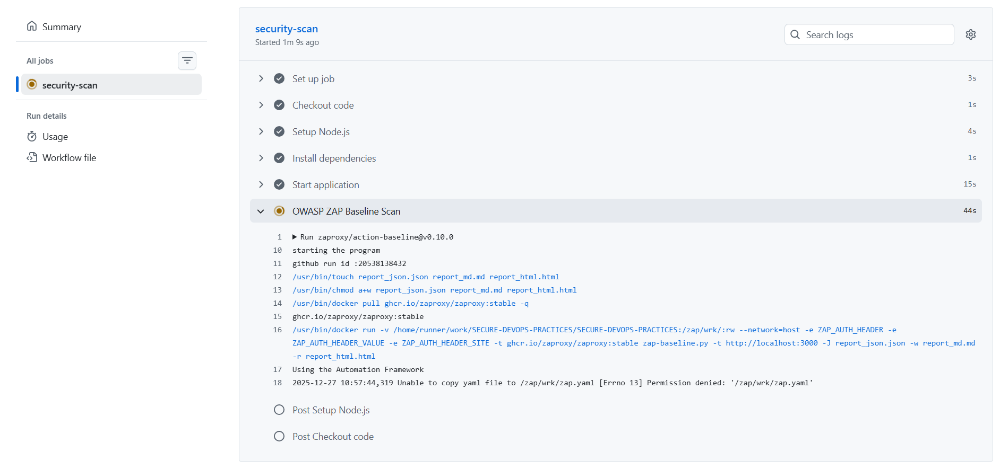
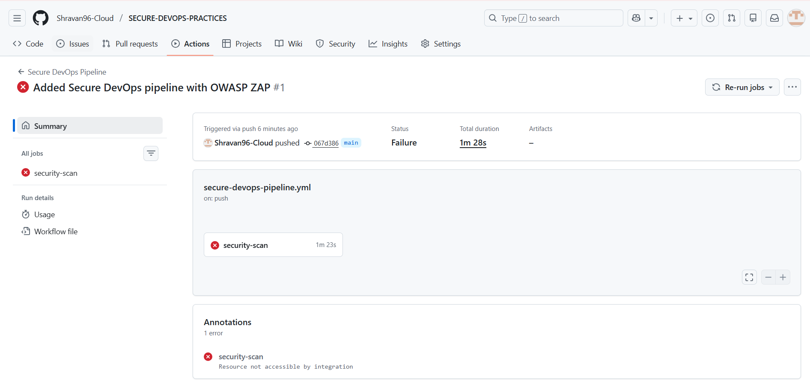
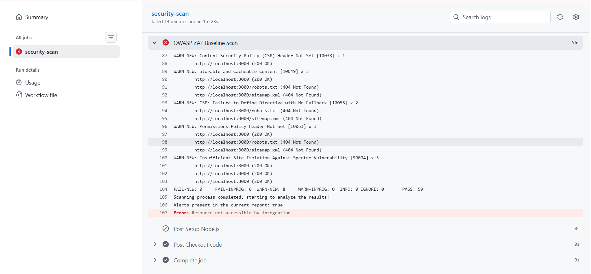
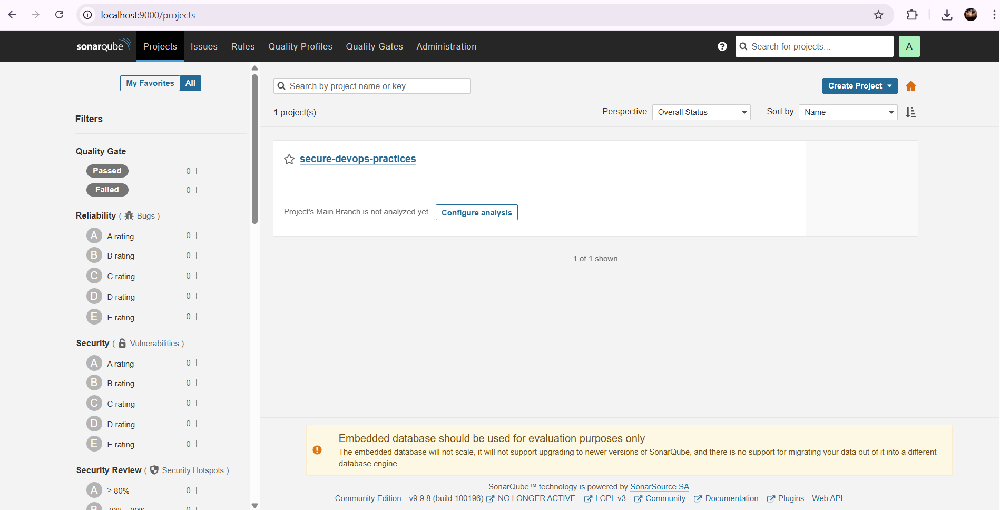

# Secure DevOps Practices

This project demonstrates **Secure DevOps practices** by integrating security scanning tools into a **CI/CD pipeline**.  
The goal of this task is to show how security checks can be automated during the development and deployment process.

---

## Tools Used

- GitHub Actions – CI/CD pipeline
- OWASP ZAP – Dynamic security vulnerability scanning
- SonarQube – Static code analysis (setup proof)
- Docker – Running SonarQube locally
- Node.js – Sample application

---

## Project Overview

A simple Node.js application was created and pushed to GitHub.  
Whenever code is pushed to the `main` branch, a GitHub Actions workflow is triggered automatically.

The pipeline performs the following steps:
1. Sets up Node.js
2. Installs application dependencies
3. Starts the application
4. Runs OWASP ZAP to scan the application for security vulnerabilities

SonarQube is also configured separately to demonstrate static code analysis setup.

---

## CI/CD Pipeline Configuration

The CI/CD pipeline is defined using GitHub Actions.  
It includes an OWASP ZAP Baseline Scan step for dynamic security testing.

---

## Pipeline Execution (Running)

After pushing the code, the pipeline starts running automatically.

---

## Pipeline Execution Result

The pipeline completes after executing all steps.  
In this case, the pipeline failed due to security-related warnings detected by OWASP ZAP.  
This behavior is expected in a Secure DevOps pipeline.

---

## OWASP ZAP Security Scan Report

OWASP ZAP scanned the running application and detected multiple security warnings, such as:
- Missing Content Security Policy (CSP) headers
- Missing Permissions Policy headers
- Other security hardening issues

This confirms that the application contains security gaps that should be addressed.

---

## SonarQube Setup (Static Analysis)

SonarQube was set up locally using Docker to demonstrate static code analysis configuration.  
The project was created successfully in SonarQube, confirming that the static analysis tool is ready for use.

---

## Conclusion

This project successfully demonstrates **Secure DevOps practices** by:
- Integrating security scanning into a CI/CD pipeline
- Identifying security issues early using OWASP ZAP
- Setting up SonarQube for static code analysis

Security warnings detected during the pipeline execution show how DevOps workflows can help prevent insecure code from progressing further.
